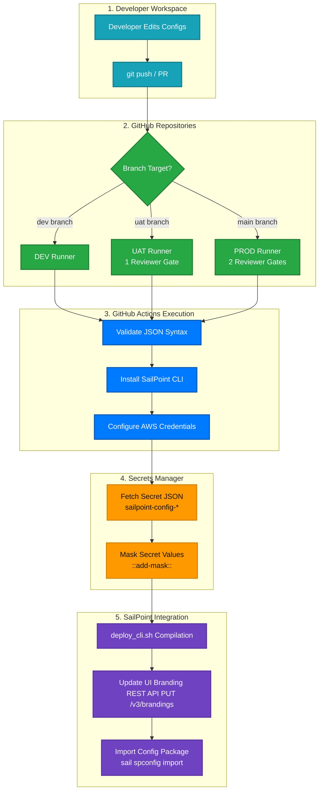

# SailPoint Identity Security Cloud (ISC) GitOps CI/CD Pipeline

This repository contains the complete, production-ready GitOps CI/CD template for automating deployments and synchronization of **SailPoint Identity Security Cloud (ISC)** configuration objects across **DEV**, **UAT**, and **PROD** tenants, integrated securely with **AWS Secrets Manager**.

---

## 🚀 Quick Start for New Developers (Beginner-Friendly)

If you are a new developer onboarding to this project, follow this 3-step guide to get your first change deployed in under 2 minutes:

### Step 1: Clone and Switch Branch
Open your terminal and run:
```bash
# 1. Clone the repository to your computer
git clone https://github.com/Yash-Thales/WCQ_SailPoint_ISC_CI-CD_SailPoint_CLI_AWS.git

# 2. Enter the repository folder
cd WCQ_SailPoint_ISC_CI-CD_SailPoint_CLI_AWS

# 3. Switch to the dev branch (where you will do your testing)
git checkout dev
```

### Step 2: Make a Test Change
*   Open the file **`config/branding/branding-meta.json`** in your editor.
*   Change the navigation color to black: `"navigationColor": "#000000"` (remember the `#` prefix).
*   Save the file.

### Step 3: Commit and Push
```bash
# 1. Stage the changed file
git add config/branding/branding-meta.json

# 2. Commit the change with a description
git commit -m "style: change brand navigation color to black"

# 3. Push to GitHub
git push origin dev
```
*That's it!* Go to the **Actions** tab on GitHub to watch your deployment pipeline validate the JSON syntax, load secrets from AWS, and deploy your changes to the DEV tenant automatically.

---

## 1. Pipeline Architecture

<div align="center">



</div>

---

## 2. Key Features & Safeguards

*   **Always-Incremental Deployments:** The deployment script compares Git history differences (`git diff HEAD~1`) and tokenizes/pushes *only* the specific JSON files that changed. This prevents bulk-import timeouts and API 504 gateway errors.
*   **Fail-Fast JSON Validation:** Before executing any API calls or installing the CLI, the pipeline runs local syntax validation on all configurations. If a syntax error (like a missing comma) exists, the run halts immediately.
*   **Zero-Keys at Rest & Masking Security:** All passwords and API keys are stored encrypted in AWS Secrets Manager. Secrets are decrypted only in the runner's memory during compilation and are immediately masked in the workflow logs (hidden as `***`).
*   **SaaS Connector Uploads:** A dedicated workflow (`deploy_connectors.yml`) packages and uploads custom web/SaaS connectors utilizing the official `sailpoint-oss/upload-saas-connector@v1` Action.
*   **Dynamic Version-Pinned CLI:** Pinned to version `2.2.12` for build repeatability, with an automated update checker warning you in the UI when a new release is available from SailPoint.

---

## 3. Branch & Environment Mapping

The pipeline dynamically maps branches to environments and enforces deployment approval gates:

| Git Branch | Target Tenant | Approval Gates | Authentication Source |
| :--- | :--- | :--- | :--- |
| **`dev`** | DEV/Sandbox | **Direct Deploy** (Immediate) | AWS Secret: `sailpoint-config-dev` |
| **`uat`** | UAT/Staging | **1 Required Reviewer** | AWS Secret: `sailpoint-config-uat` |
| **`main`** | PROD/Production | **2 Required Reviewers** | AWS Secret: `sailpoint-config-prod` |

---

## 4. Secrets Configuration

### Step 1: Configure AWS Secrets Manager
For each environment, create a Secret in your AWS Secrets Manager console using the **Key/value pairs** option:
1.  **DEV:** Secret named `sailpoint-config-dev`
2.  **UAT:** Secret named `sailpoint-config-uat`
3.  **PROD:** Secret named `sailpoint-config-prod`

Inside each secret, define the following keys:
*   `SAIL_BASE_URL`: Your SailPoint tenant URL (e.g. `https://tenant.api.identitynow.com`).
*   `SAIL_CLIENT_ID`: Your SailPoint API Client ID.
*   `SAIL_CLIENT_SECRET`: Your SailPoint API Client Secret.
*   *Other config secrets* (e.g., `AD_ADMIN_PASSWORD`): Place them here! The pipeline automatically retrieves and tokenizes them.

### Step 2: Configure GitHub Repository Secrets
Add your AWS connection keys under `Settings` -> `Secrets and variables` -> `Actions` -> `Repository secrets`:
*   `AWS_ACCESS_KEY_ID`
*   `AWS_SECRET_ACCESS_KEY`

*(Note: Change the `AWS_REGION` variable at the top of the `.yml` workflow files to match your target AWS region).*

---

## 5. Script Executions

### Running Deployments Locally (`deploy_local.ps1`)
To test a configuration locally on your laptop without pushing to GitHub, you can execute the PowerShell script:
```powershell
./scripts/deploy_local.ps1 -Environment DEV
```
*   It reads local replacement configurations from `environments/dev.json`.
*   It tokenizes the config files in memory.
*   It packages and pushes them to your DEV tenant using the local SailPoint CLI.
*   *(If environment credentials are not set, it prompts you securely in the terminal; it never saves credentials to disk).*

### Backing Up UI Changes (`export.sh`)
If configurations or brand colors are modified directly in the SailPoint UI, you can trigger the **Export Workflow** in GitHub Actions:
1.  Go to the **Actions** tab on GitHub and select **Export SailPoint ISC Configuration**.
2.  Click **Run workflow**, choose your branch (e.g. `dev`), and trigger it.
3.  The runner executes `scripts/export.sh` using the AWS Secret credentials and automatically commits the updated JSON files back to your Git branch.
4.  Run `git pull` locally in your workspace to sync your editor.
