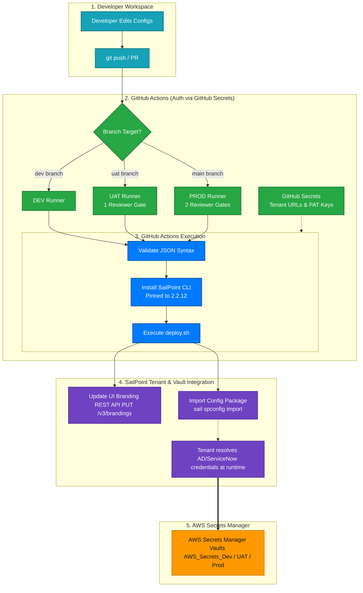

# SailPoint Identity Security Cloud (ISC) GitOps CI/CD Pipeline

This repository contains the complete, production-ready GitOps CI/CD template for automating deployments and synchronization of **SailPoint Identity Security Cloud (ISC)** configuration objects across **DEV**, **UAT**, and **PROD** tenants, integrated securely with **AWS Secrets Manager**.

---

## 🚀 Quick Start for New Developers (Beginner-Friendly)

If you are a new developer onboarding to this project, follow this 3-step guide to get your first change deployed in under 2 minutes:

### Step 1: Clone and Switch Branch
Open your terminal and run:
```bash
# 1. Clone the repository to your computer
git clone https://github.com/Yash-Thales/SailPoint_ISC_CI-CD_SailPoint_CLI_AWS.git

# 2. Enter the repository folder
cd SailPoint_ISC_CI-CD_SailPoint_CLI_AWS

# 3. Switch to the dev branch (where you will do your testing)
git checkout dev
```

### Step 2: Make a Test Change
*   Open the file **`config/branding/branding-meta.json`** in your editor.
*   Change the navigation color to black: `"navigationColor": "#000000"` (remember the `#` prefix).
*   Save the file.

### Step 3: Commit and Push
```bash
# 1. Stage the changed file
git add config/branding/branding-meta.json

# 2. Commit the change with a description
git commit -m "style: change brand navigation color to black"

# 3. Push to GitHub
git push origin dev
```
*That's it!* Go to the **Actions** tab on GitHub to watch your deployment pipeline validate the JSON syntax, load secrets from AWS, and deploy your changes to the DEV tenant automatically.

---

## 1. Pipeline Architecture

<div align="center">



</div>

---

## 2. Key Features & Safeguards

*   **Always-Incremental Deployments:** The deployment script compares Git history differences (`git diff HEAD~1`) and tokenizes/pushes *only* the specific JSON files that changed. This prevents bulk-import timeouts and API 504 gateway errors.
*   **Fail-Fast JSON Validation:** Before executing any API calls or installing the CLI, the pipeline runs local syntax validation on all configurations. If a syntax error (like a missing comma) exists, the run halts immediately.
*   **Zero-Keys at Rest:** No plain text credentials (passwords, client secrets) are stored in the git repository. Tenant connection parameters are retrieved securely via **GitHub Encrypted Secrets**. All source-specific target credentials (e.g. AD service account passwords) are stored in **AWS Secrets Manager** and resolved dynamically by the SailPoint tenant at runtime.
*   **SaaS Connector Uploads:** A dedicated workflow (`deploy_connectors.yml`) packages and uploads custom web/SaaS connectors utilizing the official `sailpoint-oss/upload-saas-connector@v1` Action.
*   **Dynamic Version-Pinned CLI:** Pinned to version `2.2.12` for build repeatability, with an automated update checker warning you in the UI when a new release is available from SailPoint.

---

## 3. Branch & Environment Mapping

The pipeline dynamically maps branches to environments and enforces deployment approval gates:

| Git Branch | Target Tenant | Approval Gates | Authentication Source |
| :--- | :--- | :--- | :--- |
| **`dev`** | DEV/Sandbox | **Direct Deploy** (Immediate) | GitHub Secrets (`DEV_CLIENT_ID`, etc.) |
| **`uat`** | UAT/Staging | **1 Required Reviewer** | GitHub Secrets (`UAT_CLIENT_ID`, etc.) |
| **`main`** | PROD/Production | **2 Required Reviewers** | GitHub Secrets (`PROD_CLIENT_ID`, etc.) |

---

## 4. Secrets Configuration

### Step 1: Configure Tenant Connection Credentials in GitHub Secrets
To allow the GitHub Actions runner to authenticate with your SailPoint tenants, add the following Repository Secrets in GitHub (`Settings` -> `Secrets and variables` -> `Actions` -> `Repository secrets`):
*   `DEV_TENANT_URL`, `DEV_CLIENT_ID`, `DEV_CLIENT_SECRET`
*   `UAT_TENANT_URL`, `UAT_CLIENT_ID`, `UAT_CLIENT_SECRET`
*   `PROD_TENANT_URL`, `PROD_CLIENT_ID`, `PROD_CLIENT_SECRET`

### Step 2: Configure Integration Credentials in AWS Secrets Manager (Tenant-Side)
For target systems (like Active Directory, ServiceNow, etc.), store their service account credentials inside your **AWS Secrets Manager** vaults:
1.  **DEV:** Store in AWS Secret container `AWS_Secrets_Dev`
2.  **UAT:** Store in AWS Secret container `AWS_Secrets_Uat`
3.  **PROD:** Store in AWS Secret container `AWS_Secrets_Prod`

In your Git configuration JSON templates, refer to these credentials using the vault path (e.g., `"password": "secrets://AWS_Secrets_Dev/AD_ServiceAccount/password"`). SailPoint will dynamically retrieve the credentials from AWS at connection time.

---

## 5. Repository Directory Structure

```text
SailPoint_ISC_CI-CD_SailPoint_CLI_AWS/
├── .github/
│   └── workflows/
│       ├── deploy.yml            # Dynamic deployment pipeline
│       ├── deploy_connectors.yml # SaaS Custom connector uploader
│       ├── export.yml            # Sync tenant config back to Git
│       └── validate.yml          # Pull request linting/syntax validator
├── config/
│   ├── access-profiles/          # Access profile blueprints
│   ├── applications/             # Configured system integrations
│   ├── branding/                 # Holds branding-meta.json & logo.png
│   ├── identity-profiles/        # Identity schema attributes
│   ├── policies/                 # Separation of Duties governance
│   ├── roles/                    # Role and provisioning models
│   ├── rules/                    # Custom target execution rules
│   ├── sources/                  # Active Directory, Workday, etc.
│   ├── transforms/               # Attribute mappings and transforms
│   └── workflows/                # Dynamic orchestration flows
├── connectors/                   # Custom SaaS connector packages
├── dr-snapshots/                 # Disaster recovery configuration backups
├── environments/                 # JSON dynamic token replacement files
├── exports/                      # Holds SailPoint_GitOps_CICD_Architecture.docx
└── scripts/                      # deploy.sh, deploy_local.ps1, export.sh
```

---

## 6. Script Executions

### Running Deployments Locally (`deploy_local.ps1`)
To test a configuration locally on your laptop without pushing to GitHub, you can execute the PowerShell script:
```powershell
./scripts/deploy_local.ps1 -Environment DEV
```
*   It reads local replacement configurations from `environments/dev.json`.
*   It tokenizes the config files in memory.
*   It packages and pushes them to your DEV tenant using the local SailPoint CLI.
*   *(If environment credentials are not set, it prompts you securely in the terminal; it never saves credentials to disk).*

### Backing Up UI Changes (`export.sh`)
If configurations or brand colors are modified directly in the SailPoint UI, you can trigger the **Export Workflow** in GitHub Actions:
1.  Go to the **Actions** tab on GitHub and select **Export SailPoint ISC Configuration**.
2.  Click **Run workflow**, choose your branch (e.g. `dev`), and trigger it.
3.  The runner executes `scripts/export.sh` using the AWS Secret credentials and automatically commits the updated JSON files back to your Git branch.
4.  Run `git pull` locally in your workspace to sync your editor.
